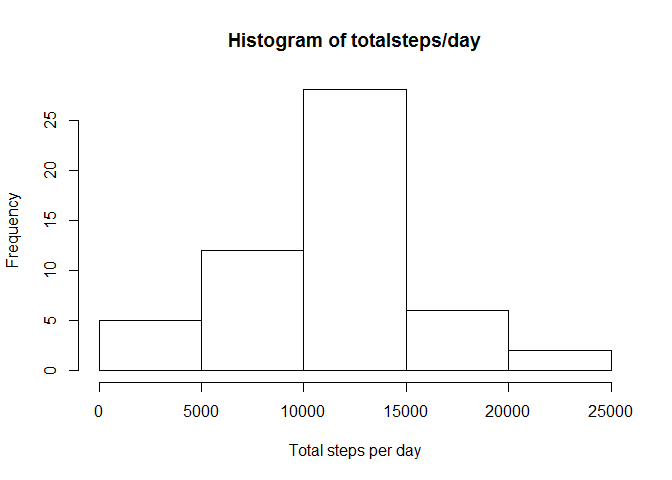

# Reproducible Research: Peer Assessment 1


## Loading and preprocessing the data

```r
unzip("activity.zip")
activity <- read.csv("./activity.csv", colClasses = c("integer","Date","numeric"), na.strings = "NA")
```

## What is mean total number of steps taken per day?
Make a histogram of the total number of steps taken each day

```r
totalsteps <- aggregate(steps ~ date, data = activity,  sum, na.rm = T)
hist(totalsteps$steps, xlab = "Total steps per day", main = "Histogram of totalsteps/day")
```

\
Calculate and report the mean and median total number of steps taken per day

```r
meansteps <- mean(totalsteps$steps)
mediansteps <- median(totalsteps$steps)
meansteps
```

```
## [1] 10766.19
```

```r
mediansteps
```

```
## [1] 10765
```

## What is the average daily activity pattern?
Make a time series plot (i.e. type = "l") of the 5-minute interval (x-axis) and the average number of steps taken, averaged across all days (y-axis)

```r
avestep_perinterval <- aggregate(steps~interval, data=activity, mean, na.rm=TRUE)
with(avestep_perinterval, plot(interval, steps, type = "l", main = "Average steps for each interval"))
```

\

Which 5-minute interval, on average across all the days in the dataset, contains the maximum number of steps?

```r
sortsteps <- avestep_perinterval[order(-avestep_perinterval$steps),]
top5intervals <- subset(sortsteps[1:5,])$interval
top5intervals
```

```
## [1] 835 840 850 845 830
```

## Imputing missing values
Calculate and report the total number of missing values in the dataset (i.e. the total number of rows with NAs)

```r
totalmiss <- sum(is.na(activity))
totalmiss
```

```
## [1] 2304
```

Devise a strategy for filling in all of the missing values in the dataset (use the mean for that 5-minute interval). Create a new dataset that is equal to the original dataset but with the missing data filled in.

```r
imputed <- activity 
for (i in 1:nrow(imputed)) {
  if (is.na(imputed$steps[i])) {
    imputed$steps[i] <- avestep_perinterval[which(imputed$interval[i] == avestep_perinterval$interval), ]$steps
  }
}
```

Make a histogram of the total number of steps taken each day and Calculate and report the mean and median total number of steps taken per day

```r
imputed_totalsteps <- aggregate(steps ~ date, data = imputed,  sum, na.rm = T)
hist(imputed_totalsteps$steps, xlab = "Total steps per day", main = "Histogram of totalsteps/day")
```

\

```r
meansteps <- mean(imputed_totalsteps$steps)
mediansteps <- median(imputed_totalsteps$steps)
meansteps
```

```
## [1] 10766.19
```

```r
mediansteps
```

```
## [1] 10766.19
```

## Are there differences in activity patterns between weekdays and weekends?
Create a new factor variable in the dataset with two levels -- "weekday" and "weekend" indicating whether a given date is a weekday or weekend day

```r
imputed$day <- weekdays(imputed$date)
for (i in 1:nrow(imputed)) {
  if (imputed$day[i] == "Saturday" | imputed$day[i] == "Sunday") {
    imputed$day[i] = "Weekend"
  } else {
    imputed$day[i] = "Weekday"
  }
}
```

Make a panel plot containing a time series plot (i.e. type = "l") of the 5-minute interval (x-axis) and the average number of steps taken, averaged across all weekday days or weekend days (y-axis)

```r
library(lattice)
avestep_perinterval <- aggregate(steps~interval + day, data=imputed, mean)
xyplot(avestep_perinterval$steps ~ avestep_perinterval$interval | avestep_perinterval$day, layout=c(1,2), type = "l", xlab = "Interval", ylab = "Number of steps")
```

\

